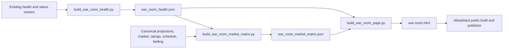
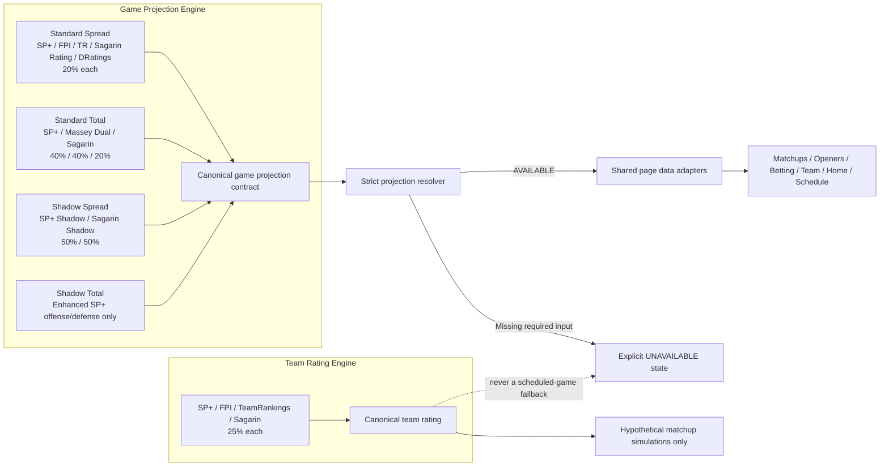

# War Room Data Architecture

## Purpose

This document is the source-of-truth map for how data is expected to move from raw providers to canonical domain contracts, page adapters, public artifacts, and GitHub Pages.

## Coverage

The diagrams cover every current public page at the **page/domain level**:

- War Room Home (`index.html`)
- War Room Command Center (`war-room.html`)
- Ratings
- Openers
- Matchups
- Odds
- Schedule
- Futures
- Conferences
- Playoff
- Simulations
- Betting
- Team
- Coaches
- V1 Reference

They do not yet enumerate every field, script, or legacy backup file. The read-only propagation audit should expand that inventory over time.

## Core rule

A public page may format canonical data differently, but it may not independently choose a source or silently substitute stale cached values.

## Standalone Command Center V1

`index.html` remains the War Room Home. The operational Command Center is a
separate public page, `war-room.html`, built by
`scripts/site/build_war_room_page.py`.

The two JSON artifacts are projections over canonical domain owners; they do
not establish new provider selection, model formulas, or market calculations.

## Canonical projection architecture

The Team Rating Engine and Game Projection Engine are separate contracts. Team
ratings are not substitutes for unavailable scheduled-game projections.

### Team Rating Engine

- SP+: 25%
- FPI: 25%
- TeamRankings: 25%
- Sagarin: 25%

Brad Powers, Massey and DRatings remain reference/research sources and do not
enter the production team-rating composite.

### Game Projection Engine

- Standard Spread: SP+ 20%, FPI 20%, TeamRankings 20%, Sagarin Rating 20%,
  DRatings 20%.
- Standard Total: SP+ 40%, Massey Dual 40%, Sagarin 20%.
- Shadow Spread: SP+ Shadow 50%, Sagarin Shadow 50%.
- Shadow Total: enhanced SP+ offense/defense model only.

Every required component must be present. Missing components produce an
explicit unavailable state. The resolver must not renormalize available
components or substitute a team-rating estimate, market rating, legacy blend,
or another provider model.

## Market semantics

- **Reference market:** representative current line used for comparison.
- **Best home / away:** best currently bettable spread for that side.
- **Best over / under:** best currently bettable total for that side.
- **History:** archived snapshots, labeled by source/book and time.
- **Freshness:** `LIVE`, `BACKUP_SOURCE`, `STALE`, or `MISSING`.

A history value can legitimately differ from a best-side value. The audit must compare like-for-like concepts.

## Stale-data policy

For real-time market data:

1. Fresh accepted quote: display normally.
2. Approved backup quote: display with backup-source indicator.
3. Stale quote: display as stale with last-observed time.
4. No current quote: display `No current market`.
5. Never display cached stale data as fresh merely because the page rebuilt.

## Development rule

Any new page or feature must:

1. declare its domain contracts in `config/public_page_data_contracts.json`;
2. consume an existing canonical contract, or add a domain contract centrally;
3. add propagation-audit checks;
4. avoid page-local source-selection logic;
5. use the explicit public publish manifest.

## Migration sequence

1. Current market contract and semantic audit.
2. Openers / Odds / Matchups / Home migration.
3. Ratings freshness contract.
4. Futures, injuries, betting, coaches, and schedule contracts.
5. Retire legacy paths only after dual-run parity checks pass.
