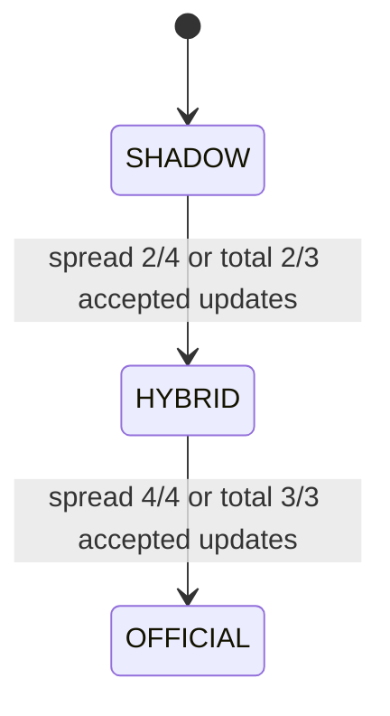
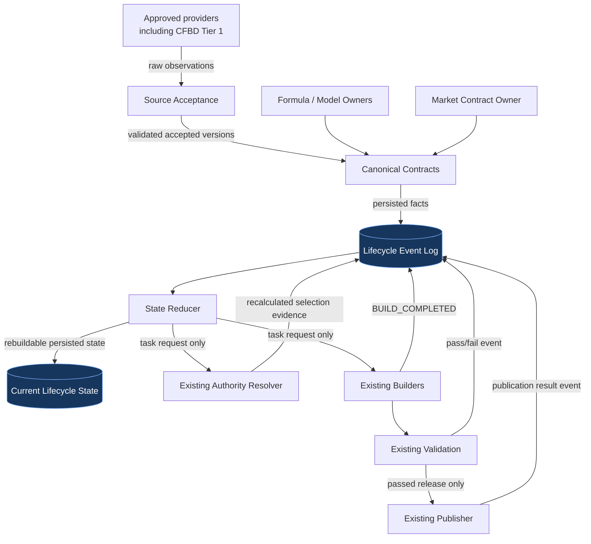

# War Room Lifecycle Operational Model

_Canonical operational lifecycle reference: 2026-08-24_
_Status: architecture only; no controller or workflow implementation_

## Purpose and authority

This document defines the complete operational lifecycle that a future War Room controller will orchestrate. It is the canonical reference for lifecycle scope, cycle boundaries, events, state reduction, task requests, persistence, simulation, and ownership.

Provider service ownership and API-budget decisions are governed by
`docs/WAR_ROOM_PROVIDER_SERVICES_AND_API_BUDGETS.md`.
Repository execution, fast-path, and publication boundaries are governed by
`docs/NCAAF_RUNTIME_UPDATE_ARCHITECTURE.md`.

It does not own projection formulas or projection-authority thresholds. Those remain governed by historical model contracts and `docs/WAR_ROOM_PROJECTION_AUTHORITY.md`. It does not alter current production behavior.

### Locked provider decisions

- **CFBD Tier 1 is approved for production.** It supplies schedule/status
  observations and `GAME_FINAL` evidence; completed-game plays, drives, and
  havoc; and preserved historical source data for replay
  and future research. Free-tier sufficiency is not an open architecture
  question.
- CFBD remains a source/acquisition owner only. It does not own projection
  authority, ratings authority, market authority, or betting edges.
- The CFBD credential is loaded only through the established protected
  secret/environment pattern. This document does not authorize
  credential or workflow changes.
- **The Odds API budget is 20,000 monthly credits with a fixed 2,000-credit
  emergency reserve.** Credits above that reserve are available for normal
  operations under the existing quota governor, cadence, overlap, and
  validation gates.

## Core architecture decision

The War Room is not one linear state machine. It is a coordinated system of six concurrent lifecycle dimensions:

1. game lifecycle;
2. weekly preparation cycle;
3. market lifecycle;
4. projection lifecycle;
5. ratings/provider and authority lifecycles; and
6. execution/publication lifecycle.

The future controller persists events, reduces them into state, and requests work from existing owners. It never becomes a formula, provider, authority, edge, UI, validation, or publication owner.

Provider tasks remain conditional after the controller requests them. The
relevant Market, Postgame, or Ratings Service owns quota/cost evaluation and
emits an approved, deferred, rejected, or quota-exceeded decision. The
controller records that decision and may dispatch only an approved task.

## 1. Lifecycle scope hierarchy

### 1.1 Game lifecycle: one matchup

```text
SCHEDULED
    |
    v
GAME_ACTIVE
    |
    v
GAME_FINAL
    |
    v
POSTGAME_PROCESSING
    |
    v
POSTGAME_READY
```

| State | Scope | Meaning | Evidence owner |
|---|---|---|---|
| `SCHEDULED` | game | Canonical game exists and has not started | Schedule contract using accepted CFBD Tier 1 status |
| `GAME_ACTIVE` | game | Accepted source says the game is in progress | CFBD Tier 1 schedule/status ingestion |
| `GAME_FINAL` | game | Final score passed canonical identity/result validation | Canonical results owner using accepted CFBD Tier 1 evidence |
| `POSTGAME_PROCESSING` | game/week task | Required postgame acquisition/features are running | Lifecycle task/attempt state |
| `POSTGAME_READY` | game | Required postgame inputs/features passed their audits | Postgame pipeline using CFBD plays, drives, and havoc |

A final creates new information. That information affects the completed matchup, both teams, their next scheduled games, Shadow features, forecasts, model settlement, and the next-week preparation cycle.

Game state is not projection authority. Multiple games can be active, final, processing, and ready concurrently.

### 1.2 Weekly preparation cycle

The next-week preparation cycle begins when the **first canonical completed game from the current week** creates new information.

```text
First Week 1 GAME_FINAL
        |
        v
2026_WK2_PREP begins
```

The cycle does not wait for all games to finish, a ratings provider to publish, a market to appear, or an operator to approve it.

A preparation cycle can concurrently contain:

- completed results and pending games from the prior week;
- postgame features for completed teams;
- partial or complete Shadow projections;
- early markets for next-week games;
- accepted provider releases;
- Shadow, Hybrid, and Official authority transitions;
- builds, validation attempts, and publications.

Recommended identity:

```text
{season}_WK{target_week}_PREP
```

Example: a first Week 1 final opens `2026_WK2_PREP`.

The cycle baseline must reference the accepted provider versions immediately before the triggering `GAME_FINAL` event. Source updates are counted relative to that frozen baseline. Ratings releases are events **inside** the preparation cycle, not cycle starters.

The cycle remains open through market close/archival for its target-week games. Overlapping cycles are possible when postponed games or early future markets cross normal weekly boundaries; state and events must therefore carry `preparation_cycle_id` rather than relying on one global “current week.”

### 1.3 Provider lifecycle: global source state

Each provider has a global accepted-version lifecycle:

```text
CHECK_REQUESTED
      |
      v
CANDIDATE_OBSERVED
      |
      +----> REJECTED (last-known-good retained)
      |
      +----> ACCEPTED_NO_CHANGE
      |
      +----> ACCEPTED_CHANGED
```

`SP+`, `FPI`, `TeamRankings`, `DRatings`, `SP+ Total`, `Massey Dual`, and `DRatings Total` participate only in the active Standard authority domains defined for them. Sagarin remains available to legacy and Shadow identities.

A provider counts as updated within a preparation cycle only after:

1. an accepted version differs from the cycle baseline;
2. source validation passes; and
3. the canonical acceptance pipeline persists the new version/fingerprint.

This update status is global. Team/game freshness remains diagnostic only and does not increment authority counts.

### 1.4 War Room operational lifecycle

```text
Preparation Cycle
        |
        v
Events arrive
        |
        v
State reduction
        |
        v
Task requests
        |
        v
Existing owners/builders execute
        |
        v
Existing validation gates
        |
        v
Existing publication owner
```

The controller requests work. Every downstream owner retains its own validation and veto authority.

## 2. Concurrent state dimensions

### Game

`SCHEDULED`, `GAME_ACTIVE`, `GAME_FINAL`, `POSTGAME_PROCESSING`, `POSTGAME_READY`, `ARCHIVED`

### Market

`UNAVAILABLE`, `FIRST_SEEN`, `OPEN`, `MOVING`, `STALE`, `CLOSED`

Market lifecycle is independent of model readiness. A next-week market can appear before Shadow or provider updates.

### Projection

Projection identity/availability states include `NOT_YET_ACTIVATED`, `MISSING_COMPONENT`, `AVAILABLE`, separately identified `DEGRADED`, and `UNAVAILABLE`. Shadow readiness includes `SHADOW_PARTIAL` and `SHADOW_READY`. Strict Official readiness is `OFFICIAL_PROJECTION_READY`.

### Ratings/provider

`CHECK_REQUESTED`, `CANDIDATE_OBSERVED`, `REJECTED`, `ACCEPTED_NO_CHANGE`, `ACCEPTED_CHANGED`. Per-game stale/current remains a parallel diagnostic.

### Authority

`SHADOW`, `HYBRID`, `OFFICIAL`, plus an independent value-availability state. Spread and total authority are resolved independently.

Canonical terminology is defined in
`docs/WAR_ROOM_PROJECTION_AUTHORITY.md`. `authority_state`, `selection_mode`,
`availability_status`, `freshness_status`, and `lifecycle_state` are orthogonal.
`HYBRID` is reserved for accepted provider updates inside an authority cycle.
`OPERATIONAL_DEGRADED` describes selection of a renormalized estimate because
canonical input coverage is incomplete; it is not an authority state and does
not record a lifecycle transition.

### Execution/publication

`PENDING`, `RUNNING`, `PASSED`, `PASSED_WITH_WARNINGS`, `FAILED`, `SKIPPED`, quota/cooldown/overlap/configuration blocks, `BUILD_COMPLETED`, `VALIDATION_PASSED`, `VALIDATION_FAILED`, `PUBLICATION_COMPLETED`, and `PUBLICATION_FAILED`.

## 3. Projection authority interaction

### Spread

| Accepted updated sources in cycle | Authority |
|---:|---|
| 0-1 of SP+, FPI, TeamRankings, DRatings | `SHADOW` |
| 2-3 of 4 | `HYBRID` |
| 4 of 4 | `OFFICIAL` |

Hybrid Spread uses only the updated canonical spread components, with their equal 25% canonical weights renormalized to 100%. It is not the strict Official four-source model identity.

### Total

| Accepted updated sources in cycle | Authority |
|---:|---|
| 0-1 of SP+ Total, Massey Dual, DRatings Total | `SHADOW` |
| 2 of 3 | `HYBRID` |
| 3 of 3 | `OFFICIAL` |

Hybrid Total uses only the updated total components, with canonical 40%/40%/20% weights renormalized to 100%. It is not the strict Official three-source model identity.

### Transition behavior



Transitions are automatic after source acceptance and authority rebuild. They do not require manual approval. Shadow remains persisted and available for comparison after it loses active authority.

### Display and edge relationship

```text
Authority State
        |
        v
Selected Projection Value
        |
        v
Displayed SPREAD MODEL / TOTAL MODEL
        |
        v
Spread Edge / Total Edge
```

Authority does not own market selection or edge arithmetic. It selects the projection value supplied to those existing calculations.

## 4. Authority and value availability are separate

Authority describes which model tier should lead. Value availability describes the condition of that tier's value.

| Value state | Meaning |
|---|---|
| `CURRENT` | Latest valid projection version for the authority tier is available |
| `STALE` | Valid value exists but its source/version age exceeds the defined current threshold |
| `CARRY_FORWARD` | Newest attempted build lacks a valid value, so the last valid value from the **same authority/model identity and cycle** is retained |
| `UNAVAILABLE` | No valid value exists for the authority/model identity |

Examples:

- `HYBRID + CURRENT`
- `OFFICIAL + STALE`
- `SHADOW + CARRY_FORWARD`
- `SHADOW + UNAVAILABLE`

Policy:

1. Display a valid value whenever one exists.
2. Never hide a value solely because its freshness is imperfect.
3. Label stale or carry-forward state explicitly with source/build timestamps.
4. Carry forward only the last valid value for the same authority/model identity and preparation cycle.
5. Do not substitute a different authority tier or fallback model.
6. Show `UNAVAILABLE` only when the active authority/model identity has no valid current or carry-forward value.

Carry-forward does not turn stale input into a new forecast. Its original model version, components, information cutoff, and build timestamp remain unchanged. The new state record adds an observation/decision timestamp and carry-forward reason.

## 5. Controller ownership

### Controller owns

- event ingestion;
- event identity and idempotency;
- deterministic state reduction;
- lifecycle transition records;
- task requests and dependency tracking;
- retry/recovery tracking;
- rebuild requests;
- append-only audit history;
- reconstruction of derived state from persisted events.

### Controller does not own

- projection formulas, coefficients, weights, HFA, or signs;
- provider selection or source-priority policy;
- provider parsing, validation, or candidate acceptance;
- authority calculation logic or thresholds;
- projection/model identity;
- market or edge calculations;
- UI logic;
- validation verdicts;
- publication approval or Git behavior.

## 6. Event contract

Events are immutable facts. Every event requires `event_id`, `event_type`, `observed_at`, source time when available, `preparation_cycle_id`, canonical entity IDs, producer, run/attempt ID, source artifact/version, content fingerprint, schema version, and causation/correlation IDs.

| Event | Producer/owner | Required payload beyond common envelope | State/task effect |
|---|---|---|---|
| `GAME_FINAL` | Canonical results owner | game, teams, week, final score, accepted source status/final time | Opens next-week prep cycle if first final; requests postgame work |
| `POSTGAME_READY` | Postgame feature owner | completed game/week, cache/features, cutoffs, audit result | Marks game ready; requests affected Shadow builds |
| `SHADOW_PARTIAL` | Shadow component owner | target game, ready/missing teams/components, model/version | Persists diagnostic state; does not grant full Shadow value |
| `SHADOW_READY` | Canonical projection owner | target game, model IDs/version, values/signs, component timestamps | Makes canonical Shadow value eligible for authority selection |
| `PROVIDER_PANEL_CHANGED` | Generic source acceptance owner | provider, prior/new accepted fingerprints, validation, acceptance time | Alias/super-event for provider change; requests affected source/projection rebuild |
| `RATING_SOURCE_UPDATED` | Ratings acceptance owner | rating source, baseline/new version, accepted timestamp, changed fields/teams | Increments relevant provider-level authority count once per version |
| `OFFICIAL_PROJECTION_READY` | Canonical projection owner | game/domain, strict model ID/version, all components, value | Records strict model availability; authority still determined separately |
| `AUTHORITY_CHANGED` | Existing authority owner | domain, prior/new tier, counts, updated providers, selected identity/value state, Hybrid weights if applicable | Requests affected adapters/build; lifecycle records but does not calculate |
| `MARKET_FIRST_SEEN` | Canonical market/history owner | game/market, first-observation semantics, quote/consensus, books, source timestamps | Opens market lifecycle; requests forecast comparison |
| `MARKET_QUOTE_ACCEPTED` | Market contract owner | game/book/market/side, line, price, source/freshness times | Appends history and requests affected view refresh |
| `MARKET_CLOSE` | Market-history owner | game/market, last accepted pre-kick state, close-rule version | Freezes evaluation market and enables settlement/archive |
| `BUILD_COMPLETED` | Public build owner | build ID, source commit, allowlisted artifact hashes | Requests validation |
| `VALIDATION_PASSED` | Existing validators | build ID, gates, warnings, manifest | Permits publication request under policy |
| `VALIDATION_FAILED` | Existing validators | build ID, failed gates/reasons | Blocks publication; requests repair/retry only when eligible |
| `PUBLICATION_COMPLETED` | Existing publisher | build/release ID, commit, artifact manifest | Records public release completion |
| `PUBLICATION_FAILED` | Existing publisher | build/release ID, failure class/details | Records failure and applies bounded retry/escalation policy |

`PROVIDER_PANEL_CHANGED` is the generic domain event; `RATING_SOURCE_UPDATED` is the ratings-specific accepted event used by authority counting. An implementation may represent the latter as a typed specialization, but it must not double-count one accepted version.

## 7. System data flow and ownership boundaries



### Persistence classification

| Item | Classification |
|---|---|
| Raw/accepted provider version | Persisted by source owner |
| Canonical contract | Persisted latest/versioned according to domain owner |
| Lifecycle event | Append-only persisted fact |
| Forecast version | Append-only persisted model output/input cutoff |
| Current lifecycle state | Persisted but rebuildable reducer output |
| Authority selection | Recalculated by authority owner, then persisted as event/version evidence |
| War Room display state | Recalculated adapter output from canonical state and authority evidence |
| Build/validation/publication outcome | Persisted event and existing run/release audit |

CFBD raw responses and accepted historical extracts belong to the source
owner's durable archive so lifecycle replay and later research do not depend
on mutable latest-only responses. Preservation does not grant CFBD authority
over downstream ratings, projections, markets, or edges.

## 8. Task request and execution semantics

The reducer emits task requests, not shell commands. A task registry maps a reviewed task type to an existing canonical owner.

Each task request requires:

- stable task key: task type + entity + input event/version;
- dependency event IDs;
- requested owner/stage;
- preparation cycle and affected games/teams/sources;
- attempt count and retry policy class;
- publication permission defaulting to false;
- terminal outcome and emitted event IDs.

Only one attempt may run per task key. Repeated equivalent events must reduce to the same state without duplicate provider calls, forecasts, history rows, or publications.

## 9. Simulation roadmap

### Phase 1 — Reducer simulation

Purpose: prove event/state/task behavior without live APIs or publication.

Fixture sequence:

```text
GAME_FINAL
  -> POSTGAME_READY
  -> SHADOW_READY
  -> RATING_SOURCE_UPDATED
  -> AUTHORITY_CHANGED
  -> MARKET_FIRST_SEEN
  -> MARKET_CLOSE
```

Also include `SHADOW_PARTIAL`, source no-change/rejection, missing newest projection with carry-forward, duplicate events, out-of-order delivery, retryable failure, and restart/rebuild.

Verify for every fixture:

```text
event
  -> deterministic state transition
  -> authority evidence observed
  -> exact bounded task request
```

Required gates:

- no network/provider calls;
- no production writes;
- no formula or authority calculation inside reducer;
- identical final state after event replay;
- duplicate event produces no duplicate task;
- out-of-order events converge or fail with explicit dependency status;
- publication task is never emitted.

### Phase 2 — Full weekend rehearsal

After reducer simulation passes, replay one isolated Week 1 to Week 2 cycle:

```text
Saturday games finish
  -> CFBD results ingest
  -> postgame processing
  -> Shadow calculation
  -> early market detection
  -> Sunday provider releases
  -> Hybrid authority transition
  -> Official authority transition
  -> affected builders
  -> validation
  -> publication simulation only
```

The rehearsal must use a temporary output/state root and recorded inputs. It must preserve source timestamps, information cutoffs, forecast versions, authority evidence, first market, and close. Simulated publication stops before Git mutation or remote push.

## 10. Persisted controller contracts required later

Candidate logical contracts, with final filenames/schema still subject to review:

- append-only lifecycle event ledger;
- append-only forecast-version ledger;
- rebuildable current reducer state;
- task request/attempt/result ledger;
- authority-cycle registry and baseline provider versions;
- dead-letter/retry queue or equivalent persisted failure state.

Credentials, raw secret values, and unrestricted command strings must never appear in these contracts.

## 11. Remaining architecture decisions

### Authority-cycle baseline/version handling

The cycle boundary is locked: the first canonical final from Week N opens Week N+1 preparation. The baseline must be the last accepted version of every authority source immediately before that triggering event.

Still to define before implementation:

- atomic baseline capture when multiple events arrive concurrently;
- behavior when the first final is discovered late;
- treatment of an accepted provider release timestamped before the first final but observed afterward;
- postseason/bowl, Week 0, postponed-game, and cross-week overlap rules;
- explicit cycle-close/archival criteria.

### Provider correction/retraction

Define whether an accepted corrected panel creates a new version without decrementing the updated count, and when a retracted/rejected-after-acceptance panel may invalidate an authority value. Authority must not silently move backward without a persisted correction event and deterministic policy.

### Event persistence

Define storage format, ordering guarantees, locking, fsync/atomicity expectations, retention, compaction, schema migration, and recovery from a partially written event.

### Forecast-version persistence

Define immutable identity, component/input fingerprints, model version, value/sign fields, timestamps, authority/value states, carry-forward linkage, and retention. Latest JSON artifacts alone are insufficient.

### Reducer-state persistence

Define indexing by preparation cycle/game/source/domain, reducer version, last applied event cursor, state fingerprint, atomic checkpointing, and full replay verification.

### Value carry-forward limits

The same-identity carry-forward policy is locked, but maximum age, cycle-crossing prohibition details, explicit expiry, and UI/status terminology must be defined before implementation. This task does not change current UI behavior.

## 12. Implementation prerequisites and order

1. Resolve the remaining baseline, correction/retraction, and carry-forward expiry policies.
2. Align the existing authority owner with provider-level global counts without changing formulas or strict model identities.
3. Complete the first real 2026 final-game acceptance through existing owners.
4. Define and review event, forecast-version, reducer-state, cycle, and attempt schemas.
5. Build the offline reducer simulation only.
6. Prove deterministic replay, idempotency, out-of-order handling, and recovery.
7. Run the isolated full-weekend rehearsal with publication simulated.
8. Only after parity, consider guarded automatic dispatch with publication disabled.
9. Connect existing validation/publication gates in a separate reviewed phase.
10. Install controlled weekend scheduling only after runtime and quota acceptance.

## Final architectural position

- The preparation cycle starts with the first final, not the first ratings release.
- Provider updates are global accepted-version events inside that cycle.
- Team/game freshness is diagnostic only for authority counting.
- Spread and total authority transition independently under locked thresholds.
- Authority and value availability are separate.
- Same-identity stale/carry-forward values remain visible and labeled; no fallback model is invented.
- The controller orchestrates facts and tasks but owns none of the calculations or release approvals.
- Simulation and replay must precede live controller automation.
