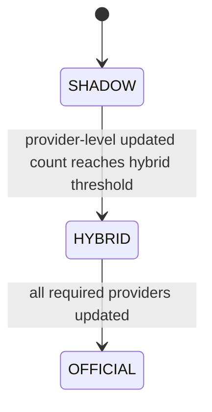

# War Room Projection Authority

_Canonical authority policy: 2026-09-01_
_Scope: selection of the displayed spread/total model and the projection value used for edges_

## Authority

This document is the canonical owner of War Room projection-authority policy. Historical betting studies and the canonical projection contract remain formula and model-identity authority. The projection resolver remains model-availability authority. This document defines **which available projection tier is operationally authoritative as accepted provider versions arrive**.

If another architecture document conflicts with this policy, this document governs authority transitions. It does not alter any model formula.

## What authority controls

Authority is resolved independently for spread and total. The active authority determines:

```text
Authority State
      |
      v
Selected Projection Value
      |
      v
Displayed SPREAD MODEL / TOTAL MODEL
      |
      v
Spread Edge / Total Edge
```

The market value, sign convention, best-price selection, and edge arithmetic remain owned by their existing canonical contracts. Authority supplies the selected projection value; it does not recalculate the market or edge formula.

Active strict identities:

- Spread `standard_spread_4src_equal_v1`: SP+, FPI, TeamRankings, and
  DRatings at 25% each.
- Total `standard_total_sp_massey_dratings_v1`: SP+ Total 40%, Massey Dual
  40%, and DRatings Total 20%.

Sagarin is excluded from active Standard authority and health. It remains an
input to `shadow_spread_sp_sagarin_v1` and registered legacy/research models.
`total_sp50_massey50_v1` is a challenger/research identity, not active
Standard Total.

## Authority states



Transitions occur immediately after an accepted provider snapshot changes the count and the existing authority owner rebuilds. No manual approval is required. Authority does not move backward within one authority cycle except through an explicit cycle reset or corrected/rejected source event under a future reviewed policy.

## Canonical projection-state terminology

Projection state is represented by five independent dimensions. Consumers must
not collapse them into one generic `status` or infer one dimension from another.

| Dimension | Canonical meaning | Representative values |
|---|---|---|
| `authority_state` | The lifecycle authority tier selected from accepted provider-version updates inside the current authority cycle | `SHADOW`, `HYBRID`, `OFFICIAL`; an explicit pre-cycle/unresolved state when no authority-cycle decision exists |
| `selection_mode` | How the displayed projection value was selected or constructed | `STRICT_OFFICIAL`, `UPDATED_SOURCES_ONLY`, `OPERATIONAL_DEGRADED`, `SHADOW`, `CARRY_FORWARD` |
| `availability_status` | Whether the named projection identity has the inputs required to emit a value | `AVAILABLE`, `DEGRADED`, `MISSING_COMPONENT`, `NOT_YET_ACTIVATED`, `UNAVAILABLE` |
| `freshness_status` | Whether the selected value and its accepted inputs satisfy the applicable time/version policy | `CURRENT`, `STALE`, `CARRY_FORWARD`, with preserved source and build timestamps |
| `lifecycle_state` | Where the game, preparation cycle, provider task, build, validation, or publication process currently sits | Examples include `PRE_GAME`, `GAME_ACTIVE`, `POSTGAME_READY`, `RATINGS_TRANSITION`, and `PUBLISHED` |

These dimensions answer different questions:

```text
authority_state    Which provider-update authority tier leads?
selection_mode     How was this particular displayed value selected?
availability_status Can the named model emit a valid value?
freshness_status   How current is that value and its evidence?
lifecycle_state    What operational process state is the system in?
```

### `HYBRID`

`HYBRID` is exclusively an `authority_state`. It means the accepted provider
update count crossed the defined intermediate threshold within an active
authority cycle. A Hybrid value uses only the accepted sources recognized as
updated relative to that cycle's frozen baseline, with their canonical weights
renormalized. Missing matchup coverage, by itself, never creates Hybrid
authority.

### `OPERATIONAL_DEGRADED`

`OPERATIONAL_DEGRADED` is a `selection_mode`, not an authority tier. It means a
separately identified operational estimate was calculated from currently
available canonical inputs because one or more inputs required by the strict
Official model identity were unavailable. Its available canonical weights may
be renormalized, but no provider-update transition is implied.

The same numeric weights can therefore have different provenance. For example,
SP+ Total plus Massey Dual may be 50% / 50% in both cases:

- it is `selection_mode = OPERATIONAL_DEGRADED` when DRatings Total is simply
  unavailable for coverage/input reasons; and
- it is `authority_state = HYBRID` only when SP+ Total and Massey Dual are
  accepted updates inside the current authority cycle and the authority owner
  selects the updated-sources-only value.

Existing artifacts that expose `authority: OPERATIONAL_DEGRADED` must be read as
legacy field placement for the operational selection mode. They do not establish
a fourth authority tier. A future contract migration may normalize the field
name, but this terminology clarification does not change current resolver,
adapter, or UI behavior.

## Definition of an updated source

A source counts as `UPDATED` for authority when all three conditions hold:

1. the provider has released a new snapshot relative to the authority cycle's accepted baseline version;
2. the candidate passes that source's validation and acceptance rules; and
3. the source acceptance pipeline recognizes and persists a new accepted version/content fingerprint.

The authority count is **provider-level and global**, not team/game specific. One accepted SP+ release counts as updated SP+ for the authority cycle for all scheduled games.

The following do not count as an authority update:

- a provider check with no accepted content change;
- a rejected or malformed candidate;
- a pull timestamp change without a recognized new accepted version;
- a page rebuild;
- team/game-specific postgame eligibility;
- a source that is not part of the relevant canonical model.

Team/game freshness remains a separate diagnostic dimension. It may show whether a provider snapshot is temporally informative for a particular team, including a bye team, but it does not change the provider-level authority count.

## Spread authority

Required spread providers and canonical weights:

| Source | Canonical weight |
|---|---:|
| SP+ | 25% |
| FPI | 25% |
| TeamRankings | 25% |
| DRatings game prediction | 25% |

| Updated provider count | Authority tier | Selected model behavior |
|---:|---|---|
| 0-1 of 4 | `SHADOW` | Select complete canonical Shadow Spread |
| 2-3 of 4 | `HYBRID` | Select the updated canonical spread components, with their canonical weights renormalized to 100% |
| 4 of 4 | `OFFICIAL` | Select complete official Standard Spread |

The Hybrid spread calculation is `RENORMALIZED_AVAILABLE_CANONICAL_WEIGHTS`, where “available” in this authority context means **accepted and updated in the current authority cycle**. It does not include stale providers merely because their prior values exist.

Because the four canonical spread weights are equal, two updated sources
receive 50% each and three receive one-third each. This is a distinct
authority-selection tier; it does not rename the partial value as
`standard_spread_4src_equal_v1` or change that official model's strict
four-source definition.

## Total authority

Required total providers and canonical weights:

| Source | Canonical weight |
|---|---:|
| SP+ Total | 40% |
| Massey Dual | 40% |
| DRatings Total | 20% |

| Updated provider count | Authority tier | Selected model behavior |
|---:|---|---|
| 0-1 of 3 | `SHADOW` | Select complete canonical Shadow Total |
| 2 of 3 | `HYBRID` | Select the two updated canonical total components, with their canonical weights renormalized to 100% |
| 3 of 3 | `OFFICIAL` | Select complete official Standard Total |

Hybrid total uses the original canonical weights, renormalized over the updated sources. Examples:

- SP+ Total + Massey Dual: 50% / 50%.
- SP+ Total + DRatings Total: 66.667% / 33.333%.
- Massey Dual + DRatings Total: 66.667% / 33.333%.

This is not a new provider formula. It is the named Hybrid authority selection
rule. It must never be emitted under the strict official
`standard_total_sp_massey_dratings_v1` identity.

## Availability versus authority threshold

Provider count determines the authority **tier**. Model completeness determines whether that tier has a selectable value.

- `SHADOW` authority requires the relevant canonical Shadow model to be `AVAILABLE`.
- `HYBRID` authority requires valid accepted values for every source counted as updated.
- `OFFICIAL` authority requires the strict official named model to be `AVAILABLE` with every required component.

No tier may fabricate a missing value. A lifecycle controller must record the authority decision and missing reason supplied by the authority/resolver owners; it must not fall back, renormalize a different set, or promote another identity on its own.

An available value remains visible when it is partial, degraded, stale, or
carry-forward. Consumers label the state and provenance rather than suppressing
an otherwise valid projection solely because Official completeness is absent.

A `DEGRADED` availability result does not imply `HYBRID` authority. Conversely,
Hybrid authority does not make the strict Official model `AVAILABLE`; it selects
a separately identified updated-sources-only value while the Official identity
remains strict.

Authority tier and value availability are separate. If the newest projection for
the active authority is unavailable, retain the last valid projection from the
same authority/model identity and preparation cycle when one exists. Label it
`STALE` or `CARRY_FORWARD` with its original model/source/build timestamps and
an explicit reason. Do not substitute another authority tier or model. Use
`UNAVAILABLE` only when no valid same-identity value exists. The complete
operational policy is defined in
`docs/WAR_ROOM_LIFECYCLE_OPERATIONAL_MODEL.md`.

## Shadow persistence

Shadow forecasts remain available after `HYBRID` or `OFFICIAL` becomes authoritative when their canonical values exist. They are retained for:

- informational comparison;
- historical timing and market-response studies;
- model monitoring and evaluation;
- lifecycle replay.

Once Hybrid or Official authority exists, Shadow does not automatically drive the displayed model or betting edge. It becomes a comparison projection unless the authority tier is reset in a later, explicitly defined cycle.

## Ownership

| Owner | Responsibility |
|---|---|
| Ratings/source acceptance pipelines | Validate candidates and persist provider-level accepted version changes |
| Canonical projection engine | Calculate strict Official and canonical Shadow projections and expose model availability |
| Existing projection authority resolver / model-maturity owner | Count accepted provider-version updates, select Shadow/Hybrid/Official, calculate the Hybrid value under this policy, and expose selection evidence |
| War Room adapter | Display the selected authority/model/value and calculate/display edges through existing canonical market arithmetic |
| Future lifecycle controller | Observe and persist authority transitions, associate event IDs, and trigger downstream rebuilds |

The lifecycle controller does **not**:

- count sources independently from the authority owner;
- calculate a Hybrid value;
- select providers;
- change model IDs, formulas, weights, HFA, or signs;
- choose fallback authority;
- calculate betting edges;
- alter display logic.

## Required authority evidence

Every future authority selection/transition record must contain:

- `authority_cycle_id`;
- market domain (`spread` or `total`);
- prior and new authority state;
- updated-source count and required-source count;
- source names, accepted version/fingerprint, validation state, and accepted timestamp;
- selected model/authority identity;
- selected value and explicit sign field;
- Hybrid components and normalized weights when applicable;
- canonical projection contract version/build timestamp;
- decision timestamp and triggering source event ID;
- unavailability reason if the selected tier has no value.

## Invariants

1. Spread and total authority are resolved independently.
2. Provider-level accepted version changes—not team/game freshness—drive counts.
3. Threshold transitions are automatic and immediate after accepted state rebuild.
4. Official model identities remain strict and complete.
5. Hybrid values use only updated canonical sources and renormalized canonical weights.
6. Hybrid values are not relabeled as Official models.
7. Shadow remains stored after losing active authority.
8. The active authority alone drives the displayed model/value and edge input.
9. The lifecycle controller observes authority; it never owns it.

## Remaining policy prerequisites

The authority-cycle boundary is now defined in
`docs/WAR_ROOM_LIFECYCLE_OPERATIONAL_MODEL.md`: the first canonical final from
Week N opens the Week N+1 preparation cycle, and its baseline is the accepted
provider-version set immediately before that event.

Before controller implementation, define atomic/late-discovery baseline
handling, provider correction/retraction behavior, and carry-forward expiry.
Threshold, source, Hybrid, ownership, display/edge, cycle-start, and
same-identity carry-forward rules are otherwise locked.

## Current implementation alignment

This policy is now the canonical architecture target, but documentation alone
does not change production behavior. The current War Room matrix
`model_freshness()` derives updated counts by comparing source dates with a
game/team completed-game watermark. That is useful diagnostic logic, but it is
not the provider-level global authority count defined here.

Before lifecycle-controller implementation, the existing authority owner must
be audited and aligned so that:

- provider-level accepted versions drive authority counts;
- team/game watermark freshness remains diagnostic only;
- spread and total use their independent thresholds;
- the selected Hybrid value carries a separate authority identity and exact
  normalized weights; and
- same-identity stale/carry-forward behavior is preserved explicitly and no
  different authority/model fallback is introduced.

No production code or behavior was changed as part of this documentation lock.
