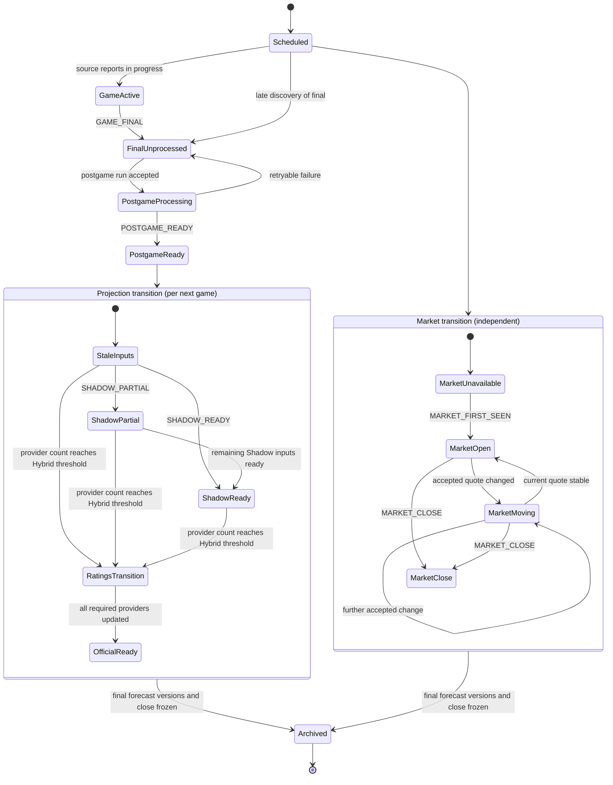

# War Room System Lifecycle

_Architecture definition: 2026-08-24_
_Status: design contract only; no lifecycle controller is implemented by this document_

The canonical operational scope hierarchy, preparation-cycle boundary,
carry-forward policy, and simulation roadmap are defined in
`docs/WAR_ROOM_LIFECYCLE_OPERATIONAL_MODEL.md`. This document remains the
detailed state/event inventory.

Provider-service ownership and UTC calendar-month budget policy are defined in
`docs/WAR_ROOM_PROVIDER_SERVICES_AND_API_BUDGETS.md`.

## Decision

The War Room lifecycle is **not one linear finite-state machine**. It is a set of orthogonal, evidence-backed state domains plus a derived operator phase.

The repository already has enough primitives to calculate the state domains. The missing production layer is primarily orchestration and durable event/version persistence: detecting changes, recording them once, invoking the existing owners, retrying safely, and publishing only after existing gates pass.

The future lifecycle layer must not calculate projections, select providers, redefine authority, transform markets, or render pages.

## Locked provider and budget policy

CFBD Tier 2 is an approved production provider. Its lifecycle responsibilities
are schedule/status updates and `GAME_FINAL` evidence; postgame plays, drives,
havoc, and advanced game statistics; and preservation of historical source
data for replay and future research. Its credential will be wired later through
the protected secret/environment pattern. CFBD does not own projection,
ratings, or market authority and does not calculate betting edges.

The Odds API has a locked 20,000-credit monthly budget. The emergency reserve
is 2,000 credits; reconciled credits above that floor are available for normal
operations under the existing acquisition gates.

## State dimensions

### 1. Game lifecycle

| State | Meaning | Existing evidence owner |
|---|---|---|
| `SCHEDULED` | Canonical game exists and has not started | Canonical schedule from accepted CFBD Tier 2 observations and preseason game identity |
| `GAME_ACTIVE` | Source reports an in-progress game | CFBD Tier 2 schedule/status ingestion; not currently persisted as a lifecycle event |
| `GAME_FINAL_UNPROCESSED` | Final score is canonical, but required postgame work is incomplete | `game_results_2026.json` plus absence/incompleteness in postgame audits |
| `POSTGAME_PROCESSING` | Required cache/features are being built for the final | Future controller state; current run-status stages can show work in progress |
| `POSTGAME_READY` | Results, required raw inputs, and postgame features passed validation | Results, CFBD Tier 2 plays/drives/havoc/advanced-stat inputs, and postgame-feature audits |
| `ARCHIVED` | Final result, close, forecasts, and lifecycle versions are frozen for research | Not implemented as one canonical state |

`GAME_ACTIVE` and exact final-transition time are not yet durable canonical events. The source schedule can express completion, but the system currently discovers it only when a scheduled/manual refresh runs.

### 2. Market lifecycle

| State | Meaning | Existing evidence owner |
|---|---|---|
| `MARKET_UNAVAILABLE` | No accepted current quote | Canonical market contract |
| `MARKET_FIRST_SEEN` | First accepted executable observation for the game/market | Historical line data can derive it; live immutable event ownership is incomplete |
| `MARKET_OPEN` | Accepted current quotes exist | Current-market contract or fast War Room market |
| `MARKET_MOVING` | Current accepted value differs from prior observation | Durable line-history/movement builders |
| `MARKET_STALE` | Prior quote exists but fails current freshness policy | Canonical market freshness state |
| `MARKET_CLOSE` | Last accepted pre-kick observation has been frozen | Historical datasets support it; live event completeness is not centrally enforced |

These are different from source freshness states `LIVE`, `BACKUP_SOURCE`, `STALE`, and `MISSING`, and from fast venue health/participation. A market can be open while a particular book is missing, or moving while a source remains healthy.

### 3. Projection lifecycle and authority

| State | Meaning | Existing evidence owner |
|---|---|---|
| `NOT_YET_ACTIVATED` | Model is valid but activation inputs are not expected yet | Canonical projection contract |
| `MISSING_COMPONENT` | At least one required model input is absent | Canonical projection contract |
| `AVAILABLE` | Complete named model exists | Canonical projection contract |
| `DEGRADED` | Separately identified operational estimate exists | Degraded model identities in canonical contract |
| `UNAVAILABLE` | Resolver cannot select the requested model | Projection resolver |
| `SHADOW_PARTIAL` | Some Shadow update evidence exists but full named Shadow authority is not ready | Shadow component readiness; diagnostic only |
| `SHADOW_READY` | Complete named Shadow projection is selectable | Shadow component builder plus strict resolver |
| `OFFICIAL_READY` | Complete official Standard model is selectable | Strict official resolver (`AVAILABLE` only) |

Authority is a separate decision from availability. Canonical threshold,
updated-source, Hybrid-calculation, and ownership rules live in
`docs/WAR_ROOM_PROJECTION_AUTHORITY.md`. The lifecycle layer records the
authority selected by the existing authority owner; it must not count sources,
calculate a Hybrid value, or recalculate the decision.

The five canonical dimensions are `authority_state`, `selection_mode`,
`availability_status`, `freshness_status`, and `lifecycle_state`. `HYBRID`
belongs only to `authority_state` and requires accepted provider updates within
the current authority cycle. `OPERATIONAL_DEGRADED` belongs to
`selection_mode`; it denotes a separately identified renormalized estimate
caused by incomplete coverage/input availability and must not be interpreted as
an authority transition.

### 4. Ratings/source lifecycle

| State | Meaning | Existing evidence owner |
|---|---|---|
| `SOURCE_UNAVAILABLE` | No validated panel is available | Source-status/acceptance pipeline |
| `SOURCE_REJECTED` | Candidate failed validation; last-known-good is retained | Candidate acceptance/control status |
| `SOURCE_NO_CHANGE` | New check matches accepted content | `live_rating_change_status.json` |
| `SOURCE_UPDATED` | Accepted content changed | Candidate acceptance/change-status pipeline |
| `SOURCE_STALE_FOR_GAME` | Accepted panel predates the team's completed-game watermark | War Room model-freshness diagnostic |
| `SOURCE_UPDATED_FOR_GAME` | Accepted panel is after the watermark | War Room model-freshness diagnostic |
| `RATINGS_TRANSITION` | Provider-level accepted update count has crossed the Hybrid threshold for the authority cycle | Existing authority owner |
| `RATINGS_CURRENT` | Every required provider has an accepted updated version in the authority cycle | Existing authority owner |

Provider panel update state is global for authority counting. A newly accepted
SP+ panel increments the spread/total counts wherever SP+ is a required source.
Stale/current qualification against a particular team's completed-game
watermark remains a separate diagnostic and does not affect the authority
count.

### 5. Execution and publication lifecycle

| State | Meaning | Existing evidence owner |
|---|---|---|
| `PENDING` | Registered stage has not run | `daily_run_status.json` |
| `RUNNING` | Stage/run has acquired execution ownership | Daily/control run status and locks |
| `PASSED` / `PASSED_WITH_WARNINGS` | Required work passed | Daily run status |
| `FAILED` | Required work or validation failed | Daily/control run status |
| `SKIPPED` | Profile or policy excluded the stage | Daily run status |
| `BLOCKED_BY_QUOTA` | Provider quota gate stopped execution | Refresh controller |
| `BLOCKED_BY_COOLDOWN` | Refresh cadence gate stopped execution | Refresh controller |
| `BLOCKED_BY_OVERLAP` | Exclusive lock prevented concurrent execution | Refresh controller |
| `DEFERRED_BY_PROVIDER` | Provider service deferred a request under budget/cadence policy | Provider service decision consumed by controller |
| `BUILD_READY` | Public bundle has been built | Public builder completion; no named durable event yet |
| `VALIDATION_PASSED` | Public validators and parity gates passed | Site validation and publisher check |
| `PUBLISHED` | Validated artifacts were committed/pushed | Publisher/run status |

Publication state must remain downstream. `SHADOW_READY` or `MARKET_FIRST_SEEN` may request a rebuild, but only the existing validation and publication owners may authorize release.

## Derived operator phase

The page-facing War Room maturity label remains a projection/market-readiness summary, not the system controller's sole state:

- `STALE`: legacy/display synonym for the initial pre-provider-update phase;
  canonical projection authority is `SHADOW` when its complete value exists.
- `SHADOW_PARTIAL`: diagnostic partial Shadow evidence; not full Shadow authority.
- `SHADOW`: a complete Shadow model is authoritative below the Standard transition threshold.
- `HYBRID`: the accepted provider-level update count has reached 2-4 of 5
  spread sources or 2 of 3 total sources.
- `UPDATED`: display maturity corresponding to `OFFICIAL` authority, reached at
  5/5 spread or 3/3 total provider updates.

These labels may coexist with `GAME_ACTIVE`, `MARKET_MOVING`, `PUBLICATION_FAILED`, or another domain state. The controller must store the domain facts and selected authority evidence, then allow the existing matrix owner to derive the display label.

## System state diagram

The market and projection subflows are concurrent. A following-week opener can appear before Shadow is ready; provider ratings can update before or after the first market; some games may never receive every market checkpoint. The system must not force a false single sequence.

## Required events

All future lifecycle events should be append-only, immutable, idempotent by `event_id`, and carry `observed_at`, source time, run ID, source artifact, and a content fingerprint. The fingerprint identifies the artifact/version, never a credential.

| Event | Required | Created by | Minimum payload | Triggered work |
|---|:---:|---|---|---|
| `GAME_STATUS_CHANGED` | Yes | Schedule/results ingestion | game ID, prior/new source status, scores if present, source timestamps | Record status; no formula work by controller |
| `GAME_FINAL` | Yes | Canonical results owner after deterministic mapping | game ID, teams, week, kickoff, final scores, source final time if available, observed time, result artifact/version | Enqueue scoped postgame acquisition/build |
| `POSTGAME_READY` | Yes | Postgame feature owner after required audits pass | completed game ID, week, cache/feature artifacts, row counts, cutoffs, audit status | Enqueue affected team/next-game Shadow build |
| `POSTGAME_FAILED` | Yes | Orchestrator from postgame owner result | game/week, failed step, reason class, retryable flag, attempt | Retry policy or operator alert |
| `SHADOW_PARTIAL` | Conditional | Shadow component owner | target game, ready/missing team/components, model IDs/version, cutoff evidence | Persist diagnostic version; do not grant authority |
| `SHADOW_READY` | Yes | Canonical projection owner after strict resolver check | target game, Shadow model IDs/version, values/sign fields, component/source timestamps, input fingerprint | Rebuild affected adapters; compare with current market |
| `RATING_SOURCE_CHECKED` | Yes | Ratings acceptance owner | source, candidate/accepted snapshot, check time, validation state, content fingerprint | None if unchanged; audit trail |
| `RATING_SOURCE_UPDATED` | Yes | Ratings acceptance owner after accepted content changes | source, snapshot/pull/source-update times, changed team IDs/fields, accepted artifact fingerprint | Rebuild affected canonical projections and freshness |
| `RATING_SOURCE_REJECTED` | Yes | Ratings validation owner | source, candidate fingerprint, validation reasons, last-known-good reference | Alert; retain prior accepted source |
| `OFFICIAL_PROJECTION_READY` | Yes | Canonical projection owner after strict official resolution | target game, official model ID/version, complete components, values, source timestamps, fingerprint | Update adapters and market comparison |
| `AUTHORITY_SELECTION_CHANGED` | Yes | Existing authority-resolution owner, observed by lifecycle layer | game/market, prior/new selected model ID and authority, reason, input event IDs | Persist what was selected; trigger presentation rebuild |
| `MARKET_FIRST_SEEN` | Yes | Canonical market/history owner | game, market type, first accepted quote/consensus semantics, books, provider/source and provider/pull times | Compare against current forecast; preserve immutable first state |
| `MARKET_QUOTE_ACCEPTED` | Yes | Canonical or fast market owner | game/book/market/side, line, price, source, provider and pull times, freshness | Append history; rebuild affected market view |
| `MARKET_CLOSE` | Yes | Market-history owner under explicit close policy | game/market, final accepted pre-kick quotes/consensus, source timestamps, close-rule version | Freeze evaluation state; enable later settlement |
| `BUILD_COMPLETED` | Yes | Public build owner | run/build ID, source commit, allowlisted artifact hashes | Invoke validation only |
| `VALIDATION_PASSED` / `VALIDATION_FAILED` | Yes | Existing validators | build ID, gates, failures/warnings, artifact manifest | Permit or block publication |
| `PUBLICATION_COMPLETED` / `PUBLICATION_FAILED` | Yes | Existing publisher | build/release ID, commit, artifact manifest, completion/failure details | Close release attempt; alert/retry under policy |
| `LIFECYCLE_REBUILT` | Manual/recovery | Future lifecycle reducer | source event range, prior/new reducer version, state hash | Audit-only replacement of derived state, never mutation of events |

`SHADOW_READY`, `OFFICIAL_PROJECTION_READY`, and `AUTHORITY_SELECTION_CHANGED` are intentionally separate. Availability is produced by the projection engine; selection remains with the existing authority resolver; the lifecycle layer records and orchestrates their consequences.

## Ownership map

| Component | Owns | Must not own |
|---|---|---|
| CFBD Tier 2 acquisition | Schedule/status observations, `GAME_FINAL` evidence, postgame plays/drives/havoc/advanced statistics, historical source preservation | Projection authority, ratings authority, market authority, betting edges, publication |
| Canonical schedule/results ingestion | Canonical game status, validated final scores, result mapping | Shadow readiness, projection authority, publication |
| Postgame pipeline | CFBD raw-cache validation and postgame feature readiness | Rating releases, formulas, market selection |
| Ratings pipeline | Candidate validation, accepted panels, source-change facts and timestamps | Game projection formulas or authority |
| Projection engine | Named model formulas, completeness, availability, values, version/sign metadata | Workflow scheduling, provider acquisition policy, publication |
| Existing authority resolver / War Room matrix | Selection under current authority rules and derived display maturity | Event acquisition, model calculation, publication approval |
| Market collectors/contracts | Accepted quotes, source/freshness, first/history/close semantics | Projection values or authority |
| Future lifecycle controller | Event ingestion, idempotency, dependency graph, retries, derived domain states, scoped task dispatch | Formulas, weights, HFA, provider selection, authority decisions, UI, validation verdicts |
| Provider services | Acquisition truth, provider version acceptance where applicable, API economics, request-cost accounting, budget decisions | Lifecycle reduction, projection/market/edge formulas, UI, publication approval |
| Public builders | Formatting canonical contracts into artifacts | Upstream state invention or provider/model selection |
| Validators | Contract, freshness, parity, and artifact acceptance gates | Recalculating models or silently repairing data |
| Publisher | Allowlisted promotion/commit/push after gates | Data acquisition, formula ownership, bypassing validation |

## Future operating requirements

### Automatic mode

1. Poll schedule/status at a controlled cadence appropriate to active games.
2. Emit `GAME_FINAL` only after deterministic canonical mapping and final-score validation.
3. Dispatch scoped, idempotent postgame work; retry incomplete PBP under a bounded policy.
4. Emit `POSTGAME_READY`, then run the existing Shadow feature/component/contract owners for affected next games.
5. Poll ratings under source-specific cadence/budget policy; fingerprint candidates and emit update/no-change/rejection events.
6. Rebuild only affected official projections after accepted source changes.
7. Collect market updates under daily/fast credential and quota policies; preserve first-seen and movement events.
8. Rebuild War Room/public artifacts only when relevant state changes.
9. Publish only through existing validation, parity, allowlist, lock, and freshness gates.
10. Record every attempt, failure, retry, build, and publication result.

Automatic mode must support the declared Saturday 11 PM and Sunday 9 AM/2 PM/9 PM fast windows while allowing measured cadence refinement. A schedule contract is not proof that machine-local jobs are installed.

### Manual mode

An authorized operator should be able to:

- inspect current domain states and the event history;
- request a bounded game/week/source refresh;
- retry one failed lifecycle step without rerunning unrelated domains;
- replay events into a temporary state root;
- rebuild derived state from the immutable ledger;
- run validation without publication;
- publish only with existing explicit confirmation and safety gates.

Manual requests must call the same task owners and reducer as automatic mode. They must not provide alternate formulas, provider precedence, or bypass paths.

## Invariants

1. Events are append-only; derived state is rebuildable.
2. Every event is idempotent and scoped by canonical identity.
3. Source observed time, provider/source time, build time, and publication time remain distinct.
4. A latest-state artifact is never the sole historical record.
5. Missing data remains explicit; no controller fallback invents availability.
6. Official and degraded model identities remain separate.
7. Partial Shadow never silently becomes official Shadow authority.
8. Market history never overwrites current-market authority.
9. Fast War Room market remains separate from the normal current-market contract unless a separately validated central contract change is approved.
10. Publication remains fail-closed and allowlisted.

## Acceptance gates before controller implementation

- One real 2026 completed-game acceptance through results, postgame, Shadow, contract, and audit owners.
- A versioned event schema and reducer schema reviewed against all state dimensions above.
- Explicit live rules for `GAME_FINAL`, `MARKET_FIRST_SEEN`, and `MARKET_CLOSE` timestamps.
- Parameterized offline replay that writes only to an isolated root.
- Authority-cycle boundary/baseline and correction/retraction policy defined;
  all other authority rules are locked in
  `docs/WAR_ROOM_PROJECTION_AUTHORITY.md`.
- Failure/retry fixtures for late PBP, rejected ratings, missing model input, overlap, quota block, partial write, and publication failure.
- Scheduler installation audit and measured cadence acceptance under the locked
  20,000-credit monthly budget and 2,000-credit emergency reserve.
